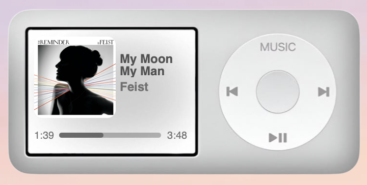
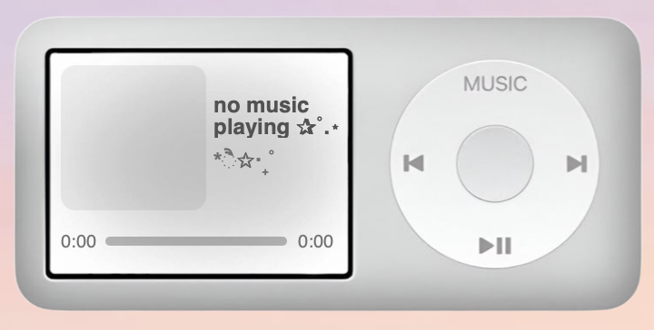

  
  

# Spotify iPod-style Übersicht widget for MacOS
Custom Übersicht widget that displays current Spotify playback, including track metadata, album artwork, playback progress, and basic controls.

## Features
- current track title and artist
- album artwork fetched directly from Spotify (locally cached and base64 encoded)
- playback progress with current position and duration
- playback controls:
  - previous track
  - next track
  - play / pause
  - open Spotify

No Spotify Web API or authentication required.

## Requirements
- macOS
- Übersicht
- Spotify desktop app

## Installation
1. Install Übersicht and launch it
2. Clone or download this repository
3. Move the widget folder into:
   `~/Library/Application Support/Übersicht/widgets/`
4. Reload widgets:
   - Übersicht menu bar → Refresh Widgets
   - (or Cmd + R)

## Notes
- album art is downloaded from spotify's CDN, cached locally & encoded to base64
- works without Spotify Premium
- no Spotify Web API used + fully local AppleScript integration
